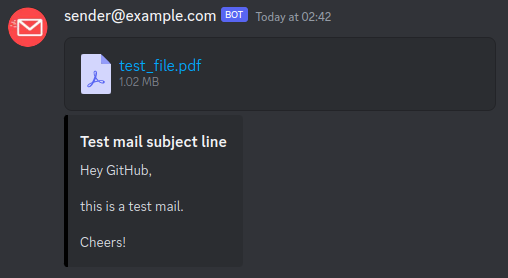

# Courier

This project is meant to redirect emails together with their attachments into a discord channel via a webhook.

## Getting started

1. Clone the repository (or at least the docker-compose.yml and config.toml)
2. Adjust the config.toml
3. Run `docker-compose up -d --remove-orphans`

### Configuration

| Section                                                            | Parameter             | Type    | Description                                                                                                                              |
|--------------------------------------------------------------------|-----------------------|---------|------------------------------------------------------------------------------------------------------------------------------------------|
| `[imap]`                                                           | server                | String  | The IMAP server address used for email retrieval.                                                                                        |
|                                                                    | port                  | Integer | The port number for the IMAP server. Usually, 993 is used for encrypted IMAP.                                                            |
|                                                                    | username              | String  | Username for authentication when accessing the IMAP server.                                                                              |
|                                                                    | password              | String  | Password for authentication when accessing the IMAP server.                                                                              |
|                                                                    | interval              | Integer | Time interval (in minutes) between each check for new emails.                                                                            |
|                                                                    | check_spf             | Boolean | A boolean indicating whether to check the Sender Policy Framework (SPF) records for incoming emails. SPF can help detect email spoofing. |
| `[discord]`                                                        | attachment_size_limit | Integer | The maximum size limit (in megabytes) for the total size of attachments.                                                                 |
|                                                                    | max_attachments       | Integer | The maximum number of attachments allowed per message when sending content to Discord using the configured webhook.                      |
|                                                                    | webhook_url           | String  | The URL of the webhook in Discord where messages and content will be sent.                                                               |
| `[mailing_list]` (this section is optional and can be omitted) | name                  | String  | The name or title associated with the mailing list. (This parameter is currently not in use)                                             |
|                                                                    | email                 | String  | The email address of to the mailing list.                                                                                                |

#### Currently, Discord sets the following limits on webhooks:

- 10 attachments per message ([discord] -> max_attachments)
- 8 MB in total for all attachments ([discord] -> attachment_size_limit)

### Prerequisites

- [Docker](https://docs.docker.com/get-docker/)
- [Docker-compose](https://docs.docker.com/compose/install/)
- [A Discord webhook](https://support.discord.com/hc/en-us/articles/228383668-Intro-to-Webhooks)
- An email account with IMAP access

## TODO

- [x] Add DOCKERFILE and docker-compose
- [x] Adjust docker-compose to point to image on dockerhub
- [ ] Use scratch image (Requires certificates to be copied to image. Maybe copy the ca-certificates.crt from the rust image?)
- [ ] Configure CI
- [ ] Clean up code
- [ ] Add logging
- [ ] Add tests
- [ ] Add optional notification about errors on different discord channel
- [ ] Use env variables instead of config file (?)
